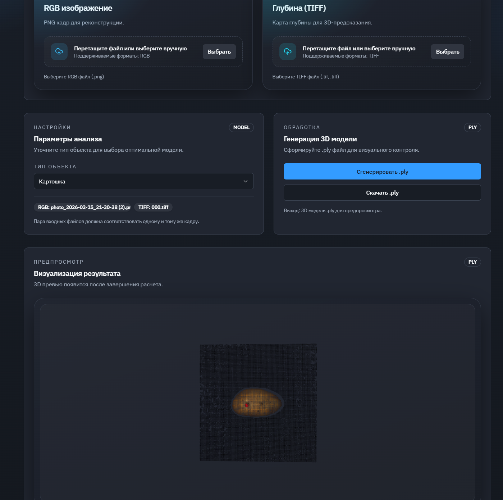

***

# 3D/2D Anomaly Detection System

<p align="center">
  
</p>

Система для обнаружения аномалий на изображениях и 3D-сканах с использованием нейросетей. Поддерживает два режима работы: 2D (сегментация) и 3D (поиск дефектов на облаке точек).

## 📥 Подготовка к запуску (Важно!)

Перед сборкой проекта необходимо скачать веса моделей, иначе сервер не запустится корректно.

1.  **Скачайте модели** по ссылке: [Яндекс.Диск](https://disk.yandex.ru/d/5i33N4VHLT8pPw)
2.  **Распакуйте/переместите** файлы в папку проекта:
    ```text
    /backend/model/
    ```
    *(Убедитесь, что файлы моделей лежат именно по этому пути)*.

## 🚀 Запуск проекта

### 1. Серверная часть (Backend)

Запустите контейнеры через Docker Compose:

```bash
docker compose up -d
```

### 2. Клиентская часть (Frontend)

Откройте терминал, перейдите в папку фронтенда и запустите режим разработки:

```bash
cd frontend
# Если запускаете первый раз, установите зависимости:
npm install 
# Запуск:
npm run dev
```

После запуска в консоли появится ссылка (обычно `http://localhost:5173` или `http://localhost:5175`). Нажмите на нее с зажатой клавишей `Ctrl`, чтобы открыть приложение в браузере.

## 🛠 Использование

Приложение предоставляет выбор между **3D** и **2D** анализом.

### 💾 Тестовые данные

*   **Для 3D-режима:** можно использовать датасет **MVTec3D**. Скачать примеры данных можно здесь: [Яндекс.Диск](https://disk.yandex.ru/d/gmCpX2DcifVxjw).
*   **Для 2D-режима (YOLO):** для быстрой проверки вы можете использовать любые `.png` или `.jpg` изображения из папки `/data/` вашего проекта.

### ⚠️ Важное примечание по категориям

В интерфейсе 3D-режима необходимо выбрать тип объекта, который вы загружаете (например, `potato`, `rope`, `tire`).

> **Внимание:** Выбранная категория должна строго соответствовать загруженному изображению!
>
> Если вы выберете категорию **Tire** (шина), а загрузите фотографию **Potato** (картошка), нейросеть отработает некорректно, и карта аномалий будет ошибочной.
